<h1 align="center">⚛️ Plataforma UCI: Unified Cognitive Intelligence</h1>

  <b>"La orquestación definitiva: Donde la autonomía agéntica y la inteligencia multimodal convergen en un ecosistema de grado empresarial."</b>

**Desarrollado por: Msc. Yanet Cesaire Velazquez**

## 📂 Documentación Técnica

Para conocer los detalles de arquitectura, desafíos técnicos superados y comparativas de rendimiento:

👉 [**Descargar Informe Técnico Completo (PDF)**](./documentos/Informe_Tecnico_Final.pdf)

*Nota: Este repositorio es un portafolio de arquitectura y diseño de sistemas de IA. El código fuente es de propiedad privada de la autora.*

## 🧠 Visión Arquitectónica

La Plataforma UCI no es una aplicación, es una infraestructura cognitiva de grado industrial. Ha sido diseñada para transformar la interacción humana con la tecnología mediante una red de microservicios y agentes especializados que colaboran bajo una jerarquía de mando. UCI resuelve los cuatro grandes retos de la IA en la empresa: Escalabilidad, Seguridad, Costo y Confiabilidad.

## 💡 Decisiones de Ingeniería y Preguntas Claves

En la construcción de la Plataforma UCI, se aplicaron principios de ingeniería de software robustos para transformar algoritmos de IA en una infraestructura operativa de grado empresarial. Estas son las respuestas a los pilares de la plataforma:

### 1.¿Por qué una Arquitectura de Microservicios Distribuidos en lugar de una Monolítica?

Ejecutar 8 agentes especializados junto con modelos multimodales y procesos de búsqueda vectorial requiere una gestión de recursos crítica:

**Escalabilidad Independiente:** El uso de Docker y Nginx permite replicar instancias de la API según la demanda, evitando cuellos de botella en la inferencia del LLM.

**Procesamiento Asíncrono (Celery + Redis):** Se delegaron las tareas pesadas (como el análisis de PDFs de cientos de páginas o el envío de correos masivos) a Workers independientes. Esto garantiza que la interfaz de usuario nunca se bloquee, manteniendo una latencia de respuesta óptima.

### 2.¿Cómo se optimizó el retorno de inversión (FinOps) y la latencia?

El costo de los tokens y el tiempo de respuesta son los mayores obstáculos para la IA empresarial. La solución fue una Caché Híbrida Multinivel:

**Caché L1 (Redis):** Entrega respuestas instantáneas (latencia cero) ante consultas idénticas.

**Caché L2 (Semántica con ChromaDB):** La plataforma es capaz de identificar si una pregunta nueva es conceptualmente similar a una anterior, reutilizando la respuesta y ahorrando hasta un 70% en costos de tokens.

**Elastic Inference:** Implementación de una lógica de fallback que conmuta automáticamente entre modelos de alto rendimiento (70B) y modelos ligeros (8B) según la complejidad de la tarea.

### 3.¿Cómo se garantiza la Seguridad y Gobernanza en un entorno corporativo?

La IA en la empresa no puede ser una "caja negra" sin supervisión. UCI implementa:

**RBAC (Control de Acceso por Roles):** El Agente Director tiene conciencia de seguridad; un usuario con rol 'USER' no puede solicitar al agente que analice la base de datos de nóminas o finanzas confidenciales.

**Cloudflare Tunneling:** Se eliminó la exposición de puertos vulnerables, creando un túnel cifrado de capa 7 para el acceso global seguro.

**Human-in-the-Loop (HITL):** Para acciones críticas (como el despacho de correos electrónicos), el sistema requiere una firma de autorización humana, mitigando riesgos reputacionales o de seguridad.

**Audit Logging (Trazabilidad Total):** UCI registra cada "pensamiento", decisión y ejecución en archivos app.log. Esta trazabilidad técnica permite auditar el comportamiento de los agentes en tiempo real, facilitando la detección de anomalías, el cumplimiento normativo (Compliance) y la depuración profunda de la cadena de razonamiento.

### 4. ¿Cuál fue el desafío técnico más complejo?

El reto principal fue la Orquestación de la Cadena de Pensamiento (LangGraph). Lograr que un "Agente Maestro" descomponga una orden compleja (ej: "Investiga el precio de la competencia en la web, compáralo con nuestra base de datos SQL y envíame un informe detallado por correo") en sub-tareas precisas, las delegue a los agentes correctos en el orden lógico, y valide la calidad del resultado antes de entregarlo, representó el mayor hito de ingeniería cognitiva del proyecto.

## ⚛️ Plataforma UCI: Arquitectura de Procesos de Negocio

He diseñado y desarrollado una infraestructura de Microservicios de Inteligencia Artificial de grado industrial, capaz de unificar el análisis de datos estructurados (SQL), la recuperación de conocimiento documental (RAG) y la investigación autonóma en tiempo real. La plataforma está cimentada bajo estándares rigurosos de MLOps y FinOps, garantizando un ecosistema escalable, seguro y económicamente sostenible.
A continuación, se detalla el desglose de la arquitectura organizado por sus seis capas de valor:

### 1. 🧠 Capa de Inteligencia: Fuerza Laboral Agéntica

UCI despliega un equipo de 8 especialistas orquestados para colaborar entre sí, superando la limitación de los chatbots convencionales:

**📊 SQL Data Expert:** Ejecuta minería de datos compleja en bases relacionales con capacidad de Self-Healing (autocorrección de sintaxis).

**🧪 Python Analytics (Excel/CSV):** Científico de datos dedicado al procesamiento de archivos, generación de estadísticas, correlaciones y proyecciones.

**📈 Python Analytics SQL:** Especialista en analítica avanzada sobre DB; calcula métricas de negocio críticas como Pareto, tendencias y segmentación.

**📄 RAG Documental:** Consultor de alta fidelidad para documentos técnicos (.pdf, .txt) con anclaje de datos para eliminar alucinaciones.

**👁️ Vision Auditor:** Procesamiento multimodal que analiza imágenes y PDFs para auditar firmas, sellos y estructuras de tablas complejas.

**🔍 Researcher Agent:** Investigador autónomo que navega la web en tiempo real para extraer inteligencia competitiva y noticias de mercado.

**⚖️ Reflection Agent:** Auditor de calidad que intercepta, evalúa y refina las respuestas de otros agentes antes de la entrega final.

**📩 Email Dispatcher:** Automatiza la comunicación ejecutiva generando informes en HTML con gráficos adjuntos vía SMTP.

### 2. 🏗️ Capa de Orquestación y Memoria: El Cerebro Maestro

El control central asegura la coherencia y eficiencia de la plataforma:

**Agente Maestro (Director):** Un orquestador basado en LangGraph que descompone objetivos complejos en sub-tareas delegadas secuencialmente.

**Caché Híbrida Multinivel:**

  **o L1 (Redis):** Respuesta instantánea para consultas idénticas.

  **o L2 (Semantic Cache - ChromaDB):** Identifica intenciones similares conceptualmente, logrando un ahorro de hasta el 70% en tokens.

**Persistencia de Estado:** Implementación de Checkpointers para mantener el contexto de la conversación (thread_id) a través de múltiples sesiones y contenedores.

### 3. 🐳 Capa de Infraestructura y Escalabilidad (MLOps)

Arquitectura Cloud-Native diseñada para la alta disponibilidad:

**Containerización:** Todo el ecosistema está inmunizado y estandarizado mediante Docker & Docker Compose.

**Nginx Load Balancer:** Reverse Proxy que distribuye la carga entre múltiples instancias de la API, garantizando resiliencia.

**Procesamiento Asíncrono:** Uso de Celery & Redis para delegar tareas pesadas a Workers distribuidos, manteniendo la fluidez de la UI.

**Cloudflare Tunnel:** Conectividad global segura mediante túneles de capa 7 con cifrado SSL/TLS, sin exposición de puertos vulnerables.

### 🛡️ 4. Capa de Seguridad y Gobernanza (UCI Standards)

Garantiza que la IA sea un activo seguro y auditable:

**RBAC (Control de Acceso por Roles):** Niveles de autoridad (ADMIN, ANALYST, USER) que restringen el acceso a datos sensibles.

**HITL (Human-in-the-Loop):** Puntos de control donde la IA solicita autorización humana para acciones críticas.

**Audit Logging:** Registro exhaustivo de la cadena de pensamiento y ejecución en app.log para trazabilidad forense y técnica.

### 💰 5. Capa de FinOps (Control Financiero)

Optimización del coste operativo en tiempo real:

**Real-Time Token Tracking:** Monitorización dinámica del consumo por modelo (Llama-3 70B/8B, Vision, Cohere).

**Dashboard de Costos:** Visualización del ROI y ahorro generado por la caché semántica.

**Inferencia Elástica:** Sistema de fallback automático que conmuta entre modelos para optimizar cuotas y presupuestos.

### 🎨 6. Interfaz de Usuario (Control Plane)

Experiencia de usuario de alta fidelidad diseñada para la toma de decisiones:

**Streamlit UI:** Diseño de alto contraste "UCI Style", optimizado para la legibilidad técnica.

**Visualización Dinámica:** Gráficos interactivos mediante Plotly.

**Thought Trace:** Animación en tiempo real que visibiliza el proceso cognitivo de la IA (Consultando, Validando, Sintetizando...).

## Microservicios
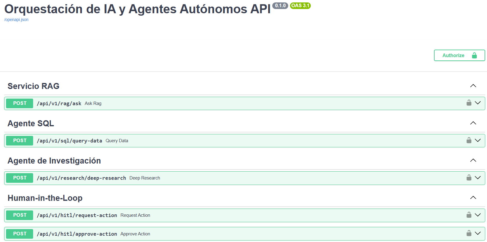

## Dockers
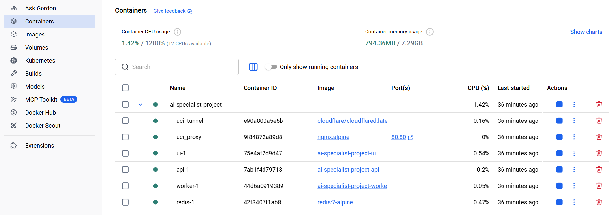

## Arquitectura

## Interfaz General
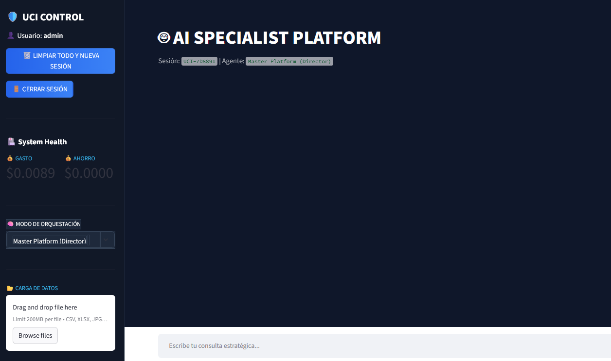

## Agente RAG Documental
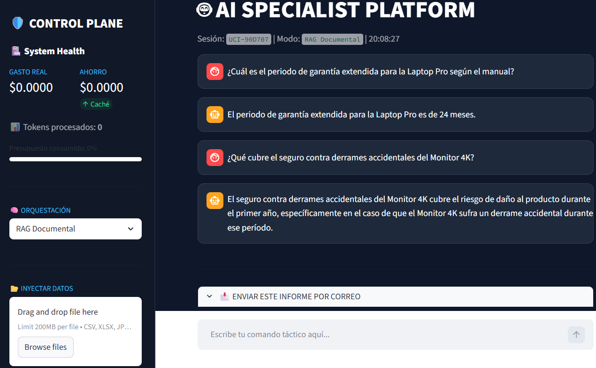

## Agente Python Analytics (CSV/Excel)
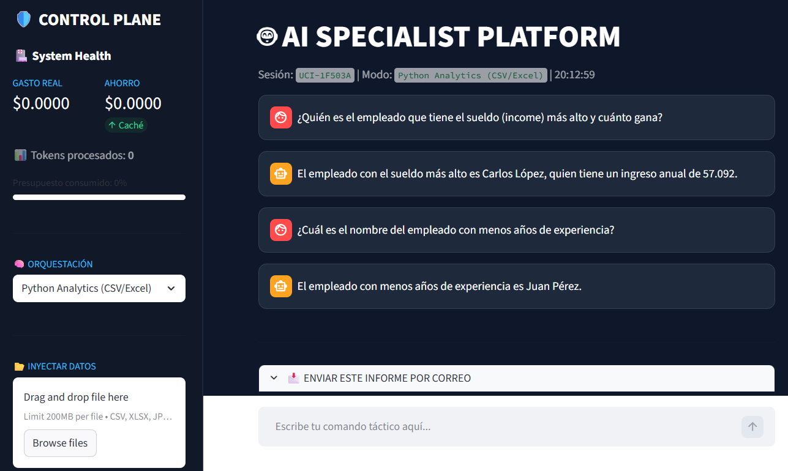

## Agente Python Analytics SQL
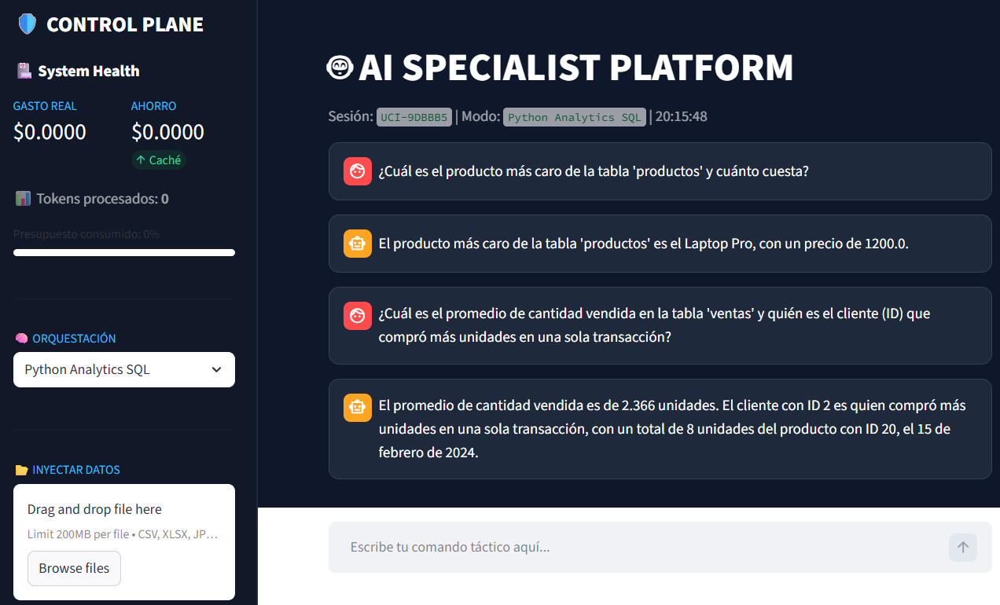

## Agente SQL Specialist (DB)
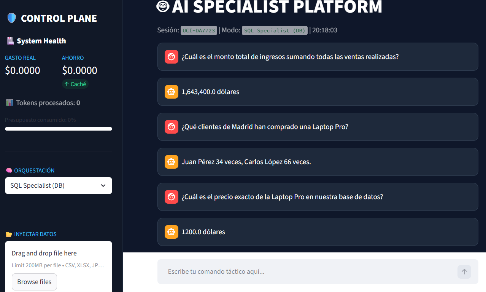

## Agente de Investigación
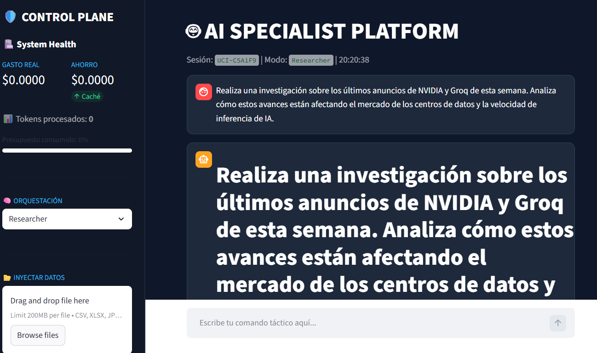
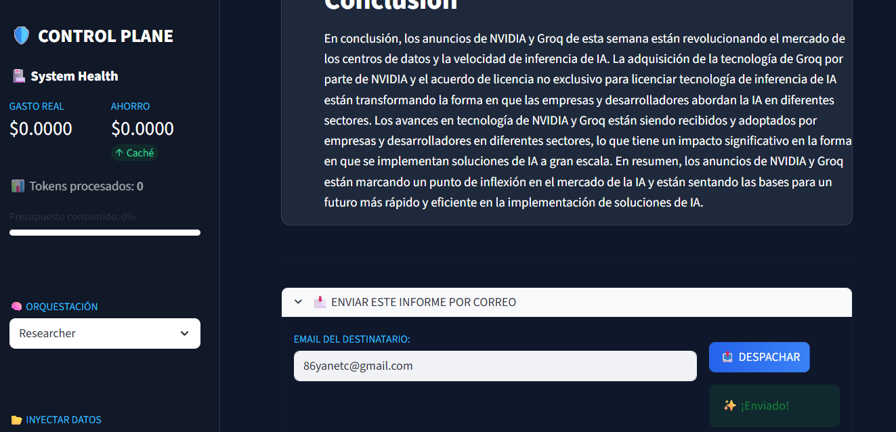

## Agente Vision 
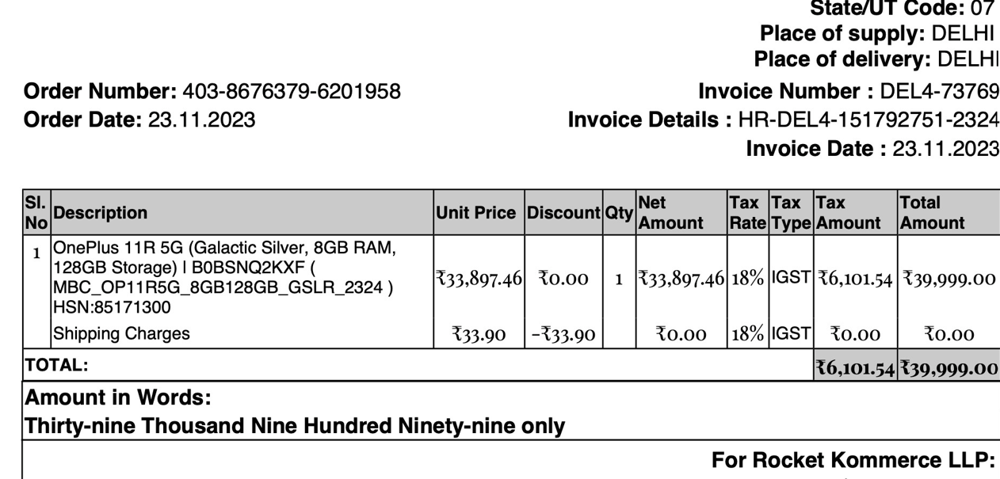

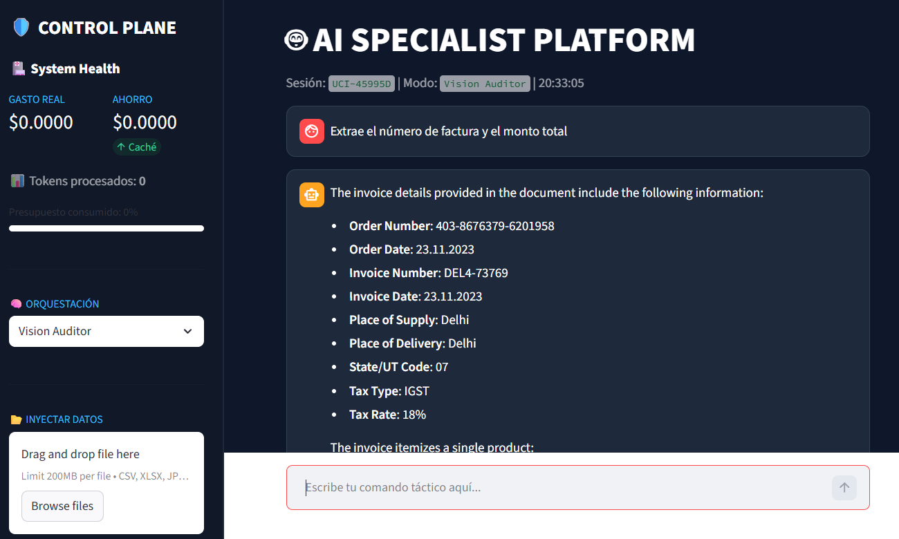

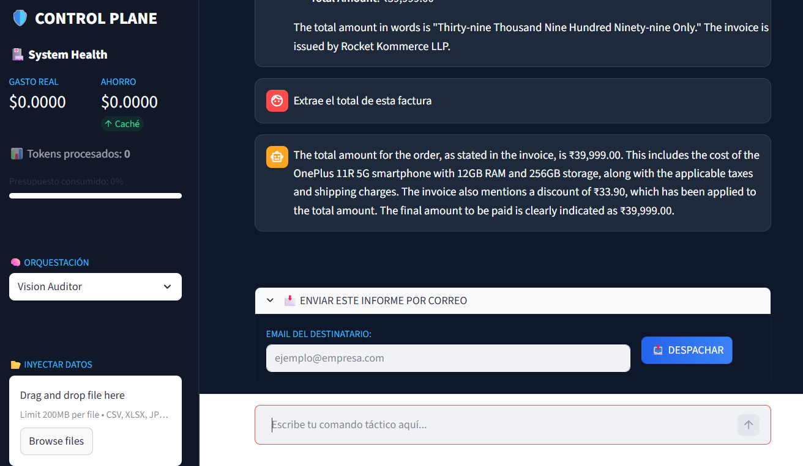

## Agente Director

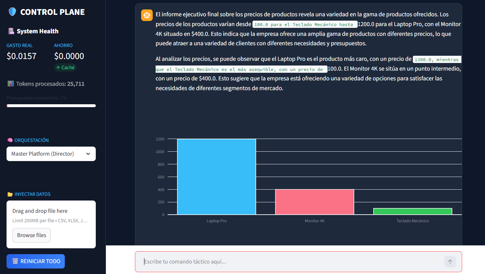

## Recepción de Correo 

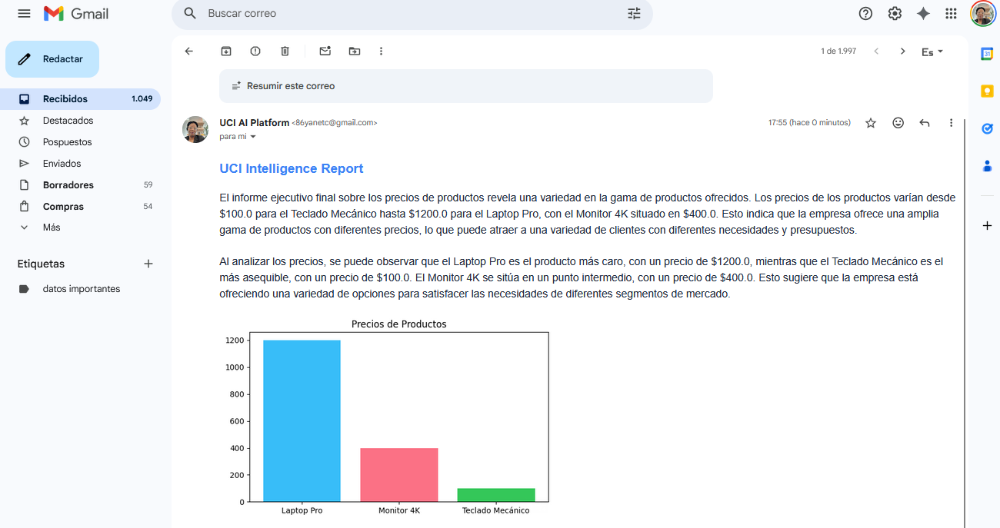

## Agente Director

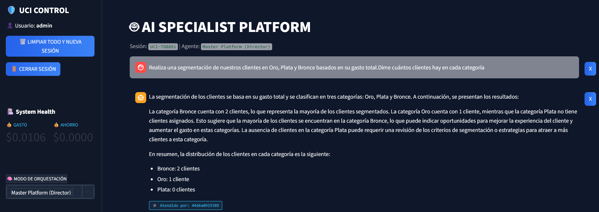
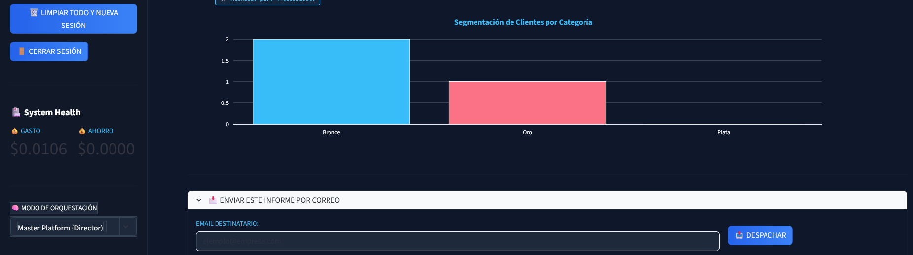

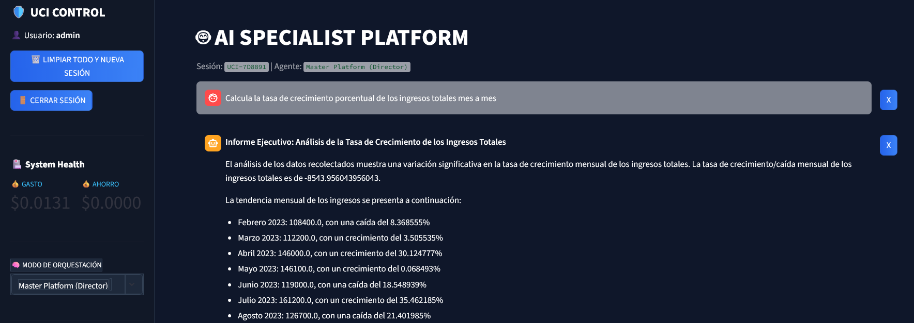
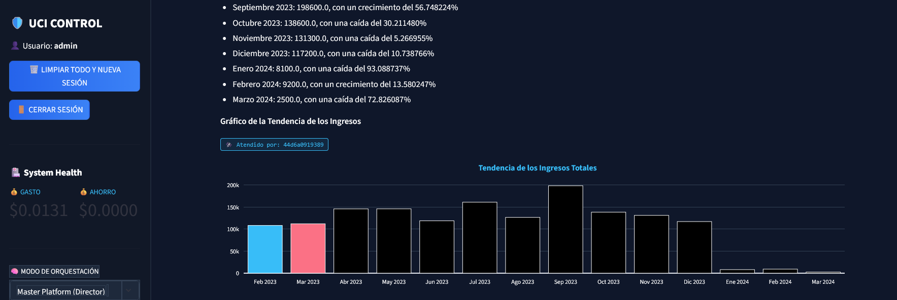